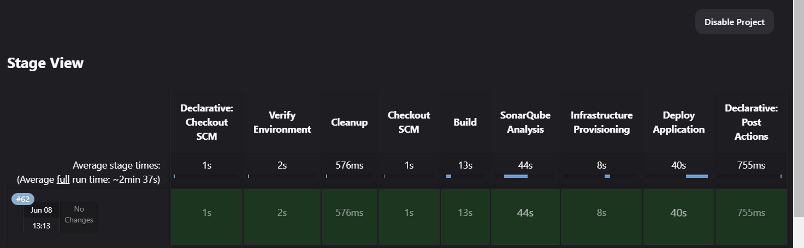

# Appendix

## Terraform Configuration

```hcl
terraform {
  required_providers {
    digitalocean = {
      source  = "digitalocean/digitalocean"
      version = "~> 2.0"
    }
  }
}

provider "digitalocean" {
  token = var.do_token
}

data "digitalocean_droplet" "existing" {
  name = "app-server"
}

resource "digitalocean_droplet" "app_server" {
  count = data.digitalocean_droplet.existing.id == "" ? 1 : 0
  image    = "ubuntu-20-04-x64"
  name     = "app-server"
  region   = "nyc3"
  size     = "s-1vcpu-1gb"
  ssh_keys = [var.ssh_key_id]

  provisioner "remote-exec" {
    inline = [
      "apt-get update && apt-get upgrade -y",
      "apt-get install -y sshpass",
      "useradd -m -s /bin/bash deployer",
      "echo 'deployer ALL=(ALL) NOPASSWD:ALL' >> /etc/sudoers",
      "mkdir -p /home/deployer/.ssh",
      "echo '${var.ssh_public_key}' > /home/deployer/.ssh/authorized_keys",
      "chown -R deployer:deployer /home/deployer/.ssh",
      "chmod 700 /home/deployer/.ssh",
      "chmod 600 /home/deployer/.ssh/authorized_keys"
    ]

    connection {
      type        = "ssh"
      user        = "root"
      private_key = file(var.ssh_private_key)
      host        = self.ipv4_address
    }
  }

  provisioner "local-exec" {
    command = <<EOF
      ssh-keyscan -H ${self.ipv4_address} >> ~/.ssh/known_hosts
    EOF
  }
}

output "app_server_ip" {
  value = coalesce(
    data.digitalocean_droplet.existing.ipv4_address,
    try(digitalocean_droplet.app_server[0].ipv4_address, null)
  )
}

```

**Terraform Configuration**
The provided Terraform configuration script is designed to automate the provisioning and initial setup of a DigitalOcean droplet, which serves as the foundation for deploying various CI/CD tools. The script includes the following key components:

- Terraform Block: Specifies the required provider, DigitalOcean in this case, and its version.

- Provider Block: Configures the DigitalOcean provider with an API token, which is stored securely as a variable.

- Data Block: Fetches information about an existing droplet named "app-server".

- Resource Block: Defines the creation of a new droplet if one does not already exist, specifying the image, name, region, size, and SSH keys.

- Provisioners:

  - Remote-Exec: Executes commands on the newly created droplet to update and upgrade packages, install sshpass, create a user (deployer), and set up SSH keys.

  - Local-Exec: Adds the new droplet's SSH fingerprint to known hosts for SSH connections.

- Output Block: Outputs the IP address of the app server, whether it was retrieved from an existing droplet or a newly created one.

This Terraform configuration script is a crucial part of the Infrastructure as Code (IaC) approach, ensuring consistent and repeatable setup of infrastructure, which aligns with the goals of the paper to integrate and automate security and infrastructure within the CI/CD pipeline.

**Terraform provisioning the Server within the Pipeline**

```bash
[Pipeline] { (Infrastructure Provisioning) (hide)
[Pipeline] dir
Running in /var/jenkins_home/workspace/TestImplementation/terraform
[Pipeline] {
[Pipeline] withCredentials
Masking supported pattern matches of $DO_TOKEN or $SSH_KEY_ID or $SSH_PRIVATE_KEY_PATH or $SSH_PUBLIC_KEY
[Pipeline] {
[Pipeline] script
[Pipeline] {
[Pipeline] sh
+ /usr/local/bin/terraform init

Initializing the backend...

Initializing provider plugins...
- Finding digitalocean/digitalocean versions matching "~> 2.0"...
- Installing digitalocean/digitalocean v2.39.2...
- Installed digitalocean/digitalocean v2.39.2 (signed by a HashiCorp partner, key ID F82037E524B9C0E8)

Partner and community providers are signed by their developers.
If you'd like to know more about provider signing, you can read about it here:
https://www.terraform.io/docs/cli/plugins/signing.html

Terraform has created a lock file .terraform.lock.hcl to record the provider
selections it made above. Include this file in your version control repository
so that Terraform can guarantee to make the same selections by default when
you run "terraform init" in the future.

Terraform has been successfully initialized!

You may now begin working with Terraform. Try running "terraform plan" to see
any changes that are required for your infrastructure. All Terraform commands
should now work.

If you ever set or change modules or backend configuration for Terraform,
rerun this command to reinitialize your working directory. If you forget, other
commands will detect it and remind you to do so if necessary.
[Pipeline] sh
Warning: A secret was passed to "sh" using Groovy String interpolation, which is insecure.
		 Affected argument(s) used the following variable(s): [SSH_KEY_ID, DO_TOKEN, SSH_PUBLIC_KEY, SSH_PRIVATE_KEY_PATH]
		 See https://jenkins.io/redirect/groovy-string-interpolation for details.
+ /usr/local/bin/terraform plan -var do_token=**** -var ssh_key_id=**** -var ssh_private_key=**** -var ssh_public_key=****

Changes to Outputs:
  + app_server_ip = "138.197.12.18"

You can apply this plan to save these new output values to the Terraform
state, without changing any real infrastructure.

─────────────────────────────────────────────────────────────────────────────

Note: You didn't use the -out option to save this plan, so Terraform can't
guarantee to take exactly these actions if you run "terraform apply" now.
[Pipeline] sh
Warning: A secret was passed to "sh" using Groovy String interpolation, which is insecure.
		 Affected argument(s) used the following variable(s): [SSH_KEY_ID, DO_TOKEN, SSH_PUBLIC_KEY, SSH_PRIVATE_KEY_PATH]
		 See https://jenkins.io/redirect/groovy-string-interpolation for details.
+ /usr/local/bin/terraform apply -auto-approve -var do_token=**** -var ssh_key_id=**** -var ssh_private_key=**** -var ssh_public_key=****

Changes to Outputs:
  + app_server_ip = "138.197.12.18"

You can apply this plan to save these new output values to the Terraform
state, without changing any real infrastructure.

Apply complete! Resources: 0 added, 0 changed, 0 destroyed.

Outputs:

app_server_ip = "138.197.12.18"
[Pipeline] sh
+ /usr/local/bin/terraform output -json
[Pipeline] readJSON
[Pipeline] }
[Pipeline] // script
[Pipeline] }
[Pipeline] // withCredentials
[Pipeline] }
[Pipeline] // dir
[Pipeline] }
[Pipeline]
```

## Ansible Playbook

```hcl
- hosts: localhost
  become: yes
  vars:
    ansible_user: "deployer"
    ssh_key_path: "/root/.ssh/id_rsa"
  tasks:
    - name: Update apt cache
      apt:
        update_cache: yes

    - name: Install Docker
      apt:
        name: docker.io
        state: present

    - name: Install Docker Compose
      shell: curl -L "https://github.com/docker/compose/releases/download/1.29.2/docker-compose-$(uname -s)-$(uname -m)" -o /usr/local/bin/docker-compose

    - name: Set permissions for Docker Compose
      file:
        path: /usr/local/bin/docker-compose
        mode: "0755"

    - name: Start Docker service
      service:
        name: docker
        state: started
        enabled: yes

    - name: Create directories for tools
      file:
        path: "{{ item }}"
        state: directory
        mode: "0755"
      with_items:
        - /opt/jenkins
        - /opt/sonarqube/data
        - /opt/grafana/data
        - /opt/grafana/provisioning/datasources
        - /opt/prometheus/data

    - name: Ensure the Docker network exists
      shell: |
        if ! docker network ls | grep -q cicd_network; then
          docker network create cicd_network
        fi

    - name: Create Prometheus configuration file
      copy:
        dest: /opt/prometheus/prometheus.yml
        content: |
          global:
            scrape_interval: 15s

          scrape_configs:
            - job_name: 'jenkins'
              static_configs:
                - targets: ['jenkins:8080']

    - name: Create Grafana provisioning file for Prometheus
      copy:
        dest: /opt/grafana/provisioning/datasources/prometheus.yml
        content: |
          apiVersion: 1
          datasources:
            - name: Prometheus
              type: prometheus
              access: proxy
              url: http://prometheus:9090
              isDefault: true

    - name: Run Jenkins container with required settings
      shell: |
        docker stop jenkins || true
        docker rm jenkins || true
        docker run -d -u root --privileged=true \
          --network cicd_network \
          --volume /opt/jenkins/jenkins_home:/var/jenkins_home \
          -v /var/run/docker.sock:/var/run/docker.sock \
          -v "{{ ssh_key_path }}:/root/.ssh/id_rsa" \
          -p 8080:8080 -p 50000:50000 --name jenkins jenkins/jenkins:lts

    - name: Install Terraform in Jenkins container
      shell: |
        docker exec -u root jenkins bash -c "apt-get update && apt-get install -y wget unzip && \
        wget https://releases.hashicorp.com/terraform/1.1.5/terraform_1.1.5_linux_amd64.zip && \
        unzip terraform_1.1.5_linux_amd64.zip && mv terraform /usr/local/bin/ && \
        rm terraform_1.1.5_linux_amd64.zip"

    - name: Create Docker Compose file for SonarQube
      copy:
        dest: /opt/sonarqube/docker-compose.yml
        content: |
          version: '3'
          services:
            sonarqube:
              image: sonarqube
              container_name: sonarqube
              ports:
                - "0.0.0.0:9000:9000"
              networks:
                - cicd_network
              volumes:
                - /opt/sonarqube/data/sonarqube-data:/opt/sonarqube/data
          networks:
            cicd_network:
              external: true

    - name: Create Docker Compose file for Grafana
      copy:
        dest: /opt/grafana/docker-compose.yml
        content: |
          version: '3'
          services:
            grafana:
              image: grafana/grafana
              container_name: grafana
              ports:
                - "0.0.0.0:3000:3000"
              networks:
                - cicd_network
              volumes:
                - /opt/grafana/data:/var/lib/grafana
                - /opt/grafana/provisioning:/etc/grafana/provisioning
          networks:
            cicd_network:
              external: true

    - name: Create Docker Compose file for Prometheus
      copy:
        dest: /opt/prometheus/docker-compose.yml
        content: |
          version: '3'
          services:
            prometheus:
              image: prom/prometheus
              container_name: prometheus
              ports:
                - "0.0.0.0:9090:9090"
              networks:
                - cicd_network
              volumes:
                - /opt/prometheus/data:/prometheus
                - /opt/prometheus/prometheus.yml:/etc/prometheus/prometheus.yml
          networks:
            cicd_network:
              external: true

    - name: Start SonarQube
      command: docker-compose up -d
      args:
        chdir: /opt/sonarqube

    - name: Start Grafana
      command: docker-compose up -d
      args:
        chdir: /opt/grafana

    - name: Start Prometheus
      command: docker-compose up -d
      args:
        chdir: /opt/prometheus

    - name: Restart Jenkins
      shell: docker restart jenkins

```

### Explanation

The provided Ansible playbook script automates the installation and configuration of essential tools on the provisioned DigitalOcean droplet. It includes the following tasks:

- Update apt cache: Updates the apt package cache.
- Install Docker: Installs Docker.
- Install Docker Compose: Installs Docker Compose.
- Set permissions for Docker Compose: Sets the permissions for Docker Compose.
- Start Docker service: Starts and enables the Docker service.
- Create directories for tools: Creates the necessary directories for Jenkins, SonarQube, Grafana, and Prometheus.
- Create a common Docker network: Creates a common Docker network for the containers.
- Create Prometheus configuration file: Creates the configuration file for Prometheus.
- Create Grafana provisioning file for Prometheus: Creates the provisioning file for Grafana to use Prometheus.
- Ensure the Docker network exists: This block checks if the Docker network cicd_network exists before attempting to create it, avoiding errors due to the network already existing.
- Run Jenkins container with required settings: Runs the Jenkins container with the specified settings.
- Install Terraform in Jenkins container: Installs Terraform within the Jenkins container to ensure it persists across restarts.
- Create Docker Compose file for SonarQube: Creates the Docker Compose file for SonarQube.
- Create Docker Compose file for Grafana: Creates the Docker Compose file for Grafana.
- Create Docker Compose file for Prometheus: Creates the Docker Compose file for Prometheus.
- Start SonarQube: Starts the SonarQube container.
- Start Grafana: Starts the Grafana container.
- Start Prometheus: Starts the Prometheus container.
- Restart Jenkins: Restarts the Jenkins container to apply any changes.

This Ansible playbook supports the automated configuration and deployment of the CI/CD environment, demonstrating practical implementation and management of infrastructure, aligning with the objectives of the research.

## Jenkins Pipeline Script

```hcl
pipeline {
  agent any
  environment {
  MAVEN_PROJECT_DIR = 'java-tomcat-sample'
  TERRAFORM_DIR = 'terraform'
  ANSIBLE_PLAYBOOK = 'deploy.yml'
  SONAR_TOKEN = credentials('SonarQubeServerToken')
  TERRAFORM_BIN = '/usr/local/bin/terraform'
  ANSIBLE_NAME = 'Ansible'
  ANSIBLE_HOST_KEY_CHECKING = 'False'
  }
  stages {
  stage('Verify Environment') {
  steps {
  sh 'echo $PATH'
                  sh 'terraform --version'
              }
          }
          stage('Cleanup') {
              steps {
                  deleteDir()
              }
          }
          stage('Checkout SCM') {
              steps {
                  git branch: 'dev', url: 'https://github.com/princessbethel/dissertation.git'
              }
          }
          stage('Build') {
              steps {
                  dir("${MAVEN_PROJECT_DIR}") {
  script {
  def mvnHome = tool name: 'Maven 3.9.7', type: 'maven'
  sh "${mvnHome}/bin/mvn clean package"
                      }
                  }
              }
          }
          stage('SonarQube Analysis') {
              steps {
                  withSonarQubeEnv('SonarQube') {
                      dir("${MAVEN_PROJECT_DIR}") {
  script {
  def scannerHome = tool name: 'SonarQubeScanner', type: 'hudson.plugins.sonar.SonarRunnerInstallation'
  sh """
  ${scannerHome}/bin/sonar-scanner \
                                  -Dsonar.projectKey=TestProjectCiCd \
                                  -Dsonar.projectName=TestProject_CICD \
                                  -Dsonar.projectVersion=1.0 \
                                  -Dsonar.sources=src \
                                  -Dsonar.java.binaries=target/classes \
                                  -Dsonar.host.url=http://164.90.138.210:9000 \
                                  -Dsonar.login=${SONAR_TOKEN}
  """
  }
  }
  }
  }
  }
  stage('Infrastructure Provisioning') {
  steps {
  dir("${TERRAFORM_DIR}") {
                      withCredentials([
                          string(credentialsId: 'do_token', variable: 'DO_TOKEN'),
                          string(credentialsId: 'ssh_key_id', variable: 'SSH_KEY_ID'),
                          sshUserPrivateKey(credentialsId: 'ssh_private_key', keyFileVariable: 'SSH_PRIVATE_KEY_PATH', usernameVariable: 'SSH_USER'),
                          string(credentialsId: 'ssh_public_key', variable: 'SSH_PUBLIC_KEY')
                      ]) {
                          script {
                              // Initialize Terraform
                              sh "${TERRAFORM_BIN} init"

                              // Plan Terraform changes
                              sh "${TERRAFORM_BIN} plan -var 'do_token=${DO_TOKEN}' -var 'ssh_key_id=${SSH_KEY_ID}' -var 'ssh_private_key=${SSH_PRIVATE_KEY_PATH}' -var 'ssh_public_key=${SSH_PUBLIC_KEY}'"

                              // Apply Terraform changes
                              sh "${TERRAFORM_BIN} apply -auto-approve -var 'do_token=${DO_TOKEN}' -var 'ssh_key_id=${SSH_KEY_ID}' -var 'ssh_private_key=${SSH_PRIVATE_KEY_PATH}' -var 'ssh_public_key=${SSH_PUBLIC_KEY}'"

                              // Capture Terraform output
                              def output = sh(script: "${TERRAFORM_BIN} output -json", returnStdout: true).trim()
                              def jsonOutput = readJSON text: output
                              env.SERVER_IP = jsonOutput.app_server_ip.value
                          }
                      }
                  }
              }
          }
          stage('Deploy Application') {
              steps {
                  withCredentials([
                      string(credentialsId: 'ansible_password', variable: 'ANSIBLE_PASSWORD'),
                      sshUserPrivateKey(credentialsId: 'ssh_private_key', keyFileVariable: 'SSH_KEY_FILE', passphraseVariable: '', usernameVariable: 'ANSIBLE_USER')
                  ]) {
                      script {
                          def ansibleHome = tool name: "${ANSIBLE_NAME}"
                          sh "export PATH=${ansibleHome}/bin:\$PATH"
                          sh "echo 'Ansible Home: ${ansibleHome}'"
                          sh "echo '[app_servers]\n${SERVER_IP}' > dynamic_inventory.ini"
                          sh "${ansibleHome}/bin/ansible-playbook ${ANSIBLE_PLAYBOOK} -i dynamic_inventory.ini -e ansible_user=${ANSIBLE_USER} -e ansible_password=${ANSIBLE_PASSWORD} -e server_ip=${SERVER_IP} -e workspace=${WORKSPACE}"
                      }
                  }
              }
          }
      }
      post {
          always {
              // junit '**/target/surefire-reports/*.xml'
              script {
                  if (currentBuild.currentResult == 'SUCCESS') {
                      echo 'Build succeeded!'
                  } else {
                      echo 'Build failed. Please check Jenkins for details.'
                  }
              }
          }
      }

  }
```

**Jenkins Pipeline Script**
The provided Jenkins pipeline script defines the steps for building, analyzing, provisioning, and deploying an application. It includes the following stages:

- Environment Configuration: Sets environment variables for Maven, Terraform, Ansible, and SonarQube.

- Verify Environment: Verifies the environment by printing the PATH and Terraform version.

- Cleanup: Cleans up the workspace before starting a new build.

- Checkout SCM: Checks out the source code from the Git repository.

- Build: Uses Maven to clean and package the application.

- SonarQube Analysis: Runs SonarQube analysis to assess code quality, using a configured SonarQube server and token.

- Infrastructure Provisioning: Uses Terraform to provision infrastructure, applying changes and capturing the output to retrieve the server IP.

- Deploy Application: Uses Ansible to deploy the application to the provisioned server, using a dynamically created inventory file and passing necessary credentials.

This Jenkins pipeline script demonstrates a comprehensive CI/CD process that includes continuous integration, code quality analysis, infrastructure provisioning, and deployment automation. It aligns with the research goals by showcasing how to automate and integrate various stages of the SDLC, enhancing security, efficiency, and reliability.

The figure below shows the stages within the Jenkins Pipeline

