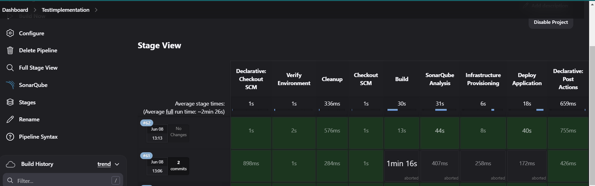

# Installation and Setup Guide

## Table of Contents

- [Installation and Setup Guide](#installation-and-setup-guide)
  - [Table of Contents](#table-of-contents)
  - [Overview](#overview)
  - [Prerequisites](#prerequisites)
- [Step 1: Provision and Configure the Primary Host](#step-1-provision-and-configure-the-primary-host)
  - [Terraform Configuration for Primary Host](#terraform-configuration-for-primary-host)
  - [Step-by-Step Guide to Determine and Set ansible_user](#step-by-step-guide-to-determine-and-set-ansible_user)
  - [Ansible Playbook for Setting Up Tools](#ansible-playbook-for-setting-up-tools)
    - [Explanation](#explanation)
    - [Running the Playbook](#running-the-playbook)
    - [Configuring Prometheus to Scrape Jenkins Metrics](#configuring-prometheus-to-scrape-jenkins-metrics)
    - [Creating a Shared Network for Docker Containers](#creating-a-shared-network-for-docker-containers)
    - [Verifying Connectivity and Monitoring](#verifying-connectivity-and-monitoring)
- [Configure Digital SSH](#configure-digital-ssh)
- [Configure Jenkins](#configure-jenkins)
- [Step 3: Install Additional Plugins](#step-3-install-additional-plugins)
- [Step 4: Configure Global Tools](#step-4-configure-global-tools)
- [Step 5: Create Jenkins Pipeline](#step-5-create-jenkins-pipeline)
  - [Repository Files Explanation](#repository-files-explanation)
    - [Jenkinsfile](#jenkinsfile)
    - [Terraform](#terraform)
- [Closing Remarks](#closing-remarks)

## Overview

This guide provides detailed steps to:

1. Provision and configure the primary host for Jenkins, SonarQube, Grafana, and Prometheus.
2. Set up Jenkins with the necessary plugins.
3. Create and configure a Jenkins pipeline for building, testing, provisioning infrastructure, and deploying a Java application.

## Prerequisites

- A DigitalOcean account with API access.
- SSH key added to your DigitalOcean account.
- Ansible installed on your local machine.

# Step 1: Provision and Configure the Primary Host

## Terraform Configuration for Primary Host

Create a directory for your Terraform configuration files and add the following files:

`main.tf`

```hcl
terraform {
  required_providers {
    digitalocean = {
      source  = "digitalocean/digitalocean"
      version = "~> 2.0"
    }
  }
}

provider "digitalocean" {
  token = var.do_token
}

data "digitalocean_droplet" "existing" {
  name = "app-server"
}

resource "digitalocean_droplet" "app_server" {
  count = data.digitalocean_droplet.existing.id == "" ? 1 : 0
  image    = "ubuntu-20-04-x64"
  name     = "app-server"
  region   = "nyc3"
  size     = "s-1vcpu-1gb"
  ssh_keys = [var.ssh_key_id]

  provisioner "remote-exec" {
    inline = [
      "apt-get update && apt-get upgrade -y",
      "apt-get install -y sshpass",
      "useradd -m -s /bin/bash deployer",
      "echo 'deployer ALL=(ALL) NOPASSWD:ALL' >> /etc/sudoers",
      "mkdir -p /home/deployer/.ssh",
      "echo '${var.ssh_public_key}' > /home/deployer/.ssh/authorized_keys",
      "chown -R deployer:deployer /home/deployer/.ssh",
      "chmod 700 /home/deployer/.ssh",
      "chmod 600 /home/deployer/.ssh/authorized_keys"
    ]

    connection {
      type        = "ssh"
      user        = "root"
      private_key = file(var.ssh_private_key)
      host        = self.ipv4_address
    }
  }

  provisioner "local-exec" {
    command = <<EOF
      ssh-keyscan -H ${self.ipv4_address} >> ~/.ssh/known_hosts
    EOF
  }
}

output "app_server_ip" {
  value = coalesce(
    data.digitalocean_droplet.existing.ipv4_address,
    try(digitalocean_droplet.app_server[0].ipv4_address, null)
  )
}

```


**_Explanation_**:

- This file contains the main Terraform configuration. It sets up a DigitalOcean droplet if one does not already exist. If a droplet already exists, it retrieves its details instead of creating a new one.
- The locals block determines whether to use an existing droplet's IP address or the newly created one.
- The output block provides the IP address of the app server.

`variables.tf`

```hcl
variable "do_token" {
  description = "DigitalOcean API token"
  type        = string
}

variable "ssh_key_id" {
  description = "DigitalOcean SSH key ID"
  type        = string
}
```

**_Explanation_**:

- This file defines the variables required for the Terraform configuration, including the DigitalOcean API token and SSH key ID.


`terraform.tfvars`

```hcl
do_token = "your_digitalocean_api_token"
ssh_key_id = "your_ssh_key_id"
```


## Step-by-Step Guide to Determine and Set ansible_user

**_Step 1: Create the User (if not already created)_**
Log in to your DigitalOcean droplet and create the user:

```sh
sudo adduser deployer
```


**_Step 2: Add SSH Key for the User_**
Add your public SSH key to the `~/.ssh/authorized_keys` file of the deployer user:

```sh
sudo mkdir /home/deployer/.ssh
sudo nano /home/deployer/.ssh/authorized_keys
# Paste your public SSH key into the file
sudo chown -R deployer:deployer /home/deployer/.ssh
sudo chmod 700 /home/deployer/.ssh
sudo chmod 600 /home/deployer/.ssh/authorized_keys

```

## Ansible Playbook for Setting Up Tools

Create an Ansible playbook file named `setup_tools.yml`:

```yml
- hosts: localhost
  become: yes
  vars:
    ansible_user: "deployer"
    ssh_key_path: "/root/.ssh/id_rsa"
  tasks:
    - name: Update apt cache
      apt:
        update_cache: yes

    - name: Install Docker
      apt:
        name: docker.io
        state: present

    - name: Install Docker Compose
      shell: curl -L "https://github.com/docker/compose/releases/download/1.29.2/docker-compose-$(uname -s)-$(uname -m)" -o /usr/local/bin/docker-compose

    - name: Set permissions for Docker Compose
      file:
        path: /usr/local/bin/docker-compose
        mode: "0755"

    - name: Start Docker service
      service:
        name: docker
        state: started
        enabled: yes

    - name: Create directories for tools
      file:
        path: "{{ item }}"
        state: directory
        mode: "0755"
      with_items:
        - /opt/jenkins
        - /opt/sonarqube/data
        - /opt/grafana/data
        - /opt/grafana/provisioning/datasources
        - /opt/prometheus/data

    - name: Ensure the Docker network exists
      shell: |
        if ! docker network ls | grep -q cicd_network; then
          docker network create cicd_network
        fi

    - name: Create Prometheus configuration file
      copy:
        dest: /opt/prometheus/prometheus.yml
        content: |
          global:
            scrape_interval: 15s

          scrape_configs:
            - job_name: 'jenkins'
              static_configs:
                - targets: ['jenkins:8080']

    - name: Create Grafana provisioning file for Prometheus
      copy:
        dest: /opt/grafana/provisioning/datasources/prometheus.yml
        content: |
          apiVersion: 1
          datasources:
            - name: Prometheus
              type: prometheus
              access: proxy
              url: http://prometheus:9090
              isDefault: true

    - name: Run Jenkins container with required settings
      shell: |
        docker stop jenkins || true
        docker rm jenkins || true
        docker run -d -u root --privileged=true \
          --network cicd_network \
          --volume /opt/jenkins/jenkins_home:/var/jenkins_home \
          -v /var/run/docker.sock:/var/run/docker.sock \
          -v "{{ ssh_key_path }}:/root/.ssh/id_rsa" \
          -p 8080:8080 -p 50000:50000 --name jenkins jenkins/jenkins:lts

    - name: Install Terraform in Jenkins container
      shell: |
        docker exec -u root jenkins bash -c "apt-get update && apt-get install -y wget unzip && \
        wget https://releases.hashicorp.com/terraform/1.1.5/terraform_1.1.5_linux_amd64.zip && \
        unzip terraform_1.1.5_linux_amd64.zip && mv terraform /usr/local/bin/ && \
        rm terraform_1.1.5_linux_amd64.zip"

    - name: Create Docker Compose file for SonarQube
      copy:
        dest: /opt/sonarqube/docker-compose.yml
        content: |
          version: '3'
          services:
            sonarqube:
              image: sonarqube
              container_name: sonarqube
              ports:
                - "0.0.0.0:9000:9000"
              networks:
                - cicd_network
              volumes:
                - /opt/sonarqube/data/sonarqube-data:/opt/sonarqube/data
          networks:
            cicd_network:
              external: true

    - name: Create Docker Compose file for Grafana
      copy:
        dest: /opt/grafana/docker-compose.yml
        content: |
          version: '3'
          services:
            grafana:
              image: grafana/grafana
              container_name: grafana
              ports:
                - "0.0.0.0:3000:3000"
              networks:
                - cicd_network
              volumes:
                - /opt/grafana/data:/var/lib/grafana
                - /opt/grafana/provisioning:/etc/grafana/provisioning
          networks:
            cicd_network:
              external: true

    - name: Create Docker Compose file for Prometheus
      copy:
        dest: /opt/prometheus/docker-compose.yml
        content: |
          version: '3'
          services:
            prometheus:
              image: prom/prometheus
              container_name: prometheus
              ports:
                - "0.0.0.0:9090:9090"
              networks:
                - cicd_network
              volumes:
                - /opt/prometheus/data:/prometheus
                - /opt/prometheus/prometheus.yml:/etc/prometheus/prometheus.yml
          networks:
            cicd_network:
              external: true

    - name: Start SonarQube
      command: docker-compose up -d
      args:
        chdir: /opt/sonarqube

    - name: Start Grafana
      command: docker-compose up -d
      args:
        chdir: /opt/grafana

    - name: Start Prometheus
      command: docker-compose up -d
      args:
        chdir: /opt/prometheus

    - name: Restart Jenkins
      shell: docker restart jenkins
```

### Explanation

- Update apt cache: Updates the apt package cache.
- Install Docker: Installs Docker.
- Install Docker Compose: Installs Docker Compose.
- Set permissions for Docker Compose: Sets the permissions for Docker Compose.
- Start Docker service: Starts and enables the Docker service.
- Create directories for tools: Creates the necessary directories for Jenkins, SonarQube, Grafana, and Prometheus.
- Create a common Docker network: Creates a common Docker network for the containers.
- Create Prometheus configuration file: Creates the configuration file for Prometheus.
- Create Grafana provisioning file for Prometheus: Creates the provisioning file for Grafana to use Prometheus.
- Ensure the Docker network exists: This block checks if the Docker network cicd_network exists before attempting to create it, avoiding errors due to the network already existing.
- Run Jenkins container with required settings: Runs the Jenkins container with the specified settings.
- Install Terraform in Jenkins container: Installs Terraform within the Jenkins container to ensure it persists across restarts.
- Create Docker Compose file for SonarQube: Creates the Docker Compose file for SonarQube.
- Create Docker Compose file for Grafana: Creates the Docker Compose file for Grafana.
- Create Docker Compose file for Prometheus: Creates the Docker Compose file for Prometheus.
- Start SonarQube: Starts the SonarQube container.
- Start Grafana: Starts the Grafana container.
- Start Prometheus: Starts the Prometheus container.
- Restart Jenkins: Restarts the Jenkins container to apply any changes.

### Running the Playbook

- Run the Ansible playbook with the following command:: `ansible-playbook -i localhost, -c local -u deployer --become --private-key /root/.ssh/id_rsa /root/cicd/setup_tools.yml`

### Configuring Prometheus to Scrape Jenkins Metrics

Edit the Prometheus configuration file `/opt/prometheus/prometheus.yml` to include the Jenkins target:

```yml
global:
  scrape_interval: 15s

scrape_configs:
  - job_name: "jenkins"
    static_configs:
      - targets: ["jenkins:8080"]
```

Restart the Prometheus container to apply the changes:

```bash
docker restart prometheus

```

### Creating a Shared Network for Docker Containers

To create a shared network for all the containers:

```bash
docker network create shared_network

```

Ensure all services are connected to this network by adding networks: - shared_network in their respective Docker Compose files, as shown in the playbook.

- Install `sshpass` on the Jenkins Container to use the 'ssh' connection type with passwords:

### Verifying Connectivity and Monitoring

1. Check Prometheus Targets:
   Access Prometheus at `http://<your-server-ip>:9090/`targets and verify that the Jenkins target is UP.

2. Set Up Grafana Dashboards:
   - Access Grafana at http://<your-server-ip>:3000.
   - Add Prometheus as a data source and configure it to point to http://prometheus:9090.
   - Import Jenkins monitoring dashboards or create custom dashboards to visualize the metrics.

This setup ensures that Jenkins, Prometheus, Grafana, and SonarQube are properly installed and configured to communicate within a shared Docker network. By following these steps, you should be able to monitor Jenkins jobs and performance metrics effectively.

Installing `sshpass` in order to ssh in the deployable machines from Jenkins server.

```bash
docker exec -it jenkins bash
apt-get update
apt-get install -y sshpass

```


- Run the following commands to set the correct permissions on the directories:

  ```bash
    # Ensure the directories exist
    sudo mkdir -p /opt/jenkins/jenkins_home
    sudo mkdir -p /opt/sonarqube/data
    sudo mkdir -p /opt/grafana/data
    sudo mkdir -p /opt/prometheus/data

    # Set the correct permissions
    sudo chown -R 1000:1000 /opt/jenkins/jenkins_home
    sudo chown -R 1000:1000 /opt/sonarqube/data
    sudo chown -R 472:472 /opt/grafana/data
    sudo chown -R 65534:65534 /opt/prometheus/data
  ```

  

- After fixing the permissions, restart the Docker containers:

  ```bash
    docker start jenkins
    docker start sonarqube
    docker start grafana
    docker start prometheus

  ```

  

# Configure Digital SSH

You need to authenticate doctl with your DigitalOcean API token. Here’s how:

1. **_Obtain DigitalOcean API Token:_**

   - Go to your DigitalOcean Control Panel.
   - Generate a new personal access token if you don’t have one already. Copy the token.

2. **_Authenticate `doctl`:_**
   - Run the following command and paste your API token when prompted:
     ```bash
     doctl auth init
     ```
     
3. **_List SSH Keys_**
   - After authenticating, you can list your SSH keys to get the SSH key ID:
     ```bash
     doctl compute ssh-key list
     ```
     

# Configure Jenkins

1. Access Jenkins Dashboard:

   - Navigate to `http://<your-jenkins-server-ip>:8080`.

2. Unlock Jenkins:

   - During the first time accessing Jenkins, you will be asked to unlock it using an initial admin password. This password is stored in the `/var/jenkins_home/secrets/initialAdminPassword` file.
     

   - Retrieve the password by running the following command on your server: `sudo cat /opt/jenkins/jenkins_home/secrets/initialAdminPassword`
     
   - Enter this password in the Jenkins web interface.

3. Install Suggested Plugins:

   - Follow the prompts to install the suggested plugins. Jenkins will install the default set of plugins necessary for most CI/CD tasks.
     
     

4. Create Admin User:

   - After the plugins are installed, you will be prompted to create an admin user. Fill in the required details and save.

5. Configure Jenkins URL:
   - Set the Jenkins URL to http://<your-jenkins-server-ip>:8080 when prompted.
     

# Step 3: Install Additional Plugins

1. Manage Jenkins:

   - Go to `Manage Jenkins` > `Manage Plugins`.

2. Available Tab:

   - Search for and install the following plugins:
     - Git Plugin
     - Maven Integration Plugin
     - Terraform Plugin
     - Ansible Plugin
     - SonarQube Scanner Plugin
     - Checkmarx Plugin

   

   

# Step 4: Configure Global Tools

1. Maven Integration Plugin:

   - Go to Manage Jenkins > Tools.
   - Under Maven, click Add Maven.
   - Provide a name (e.g., Maven 3.6.3) and specify the Maven installation method (automatic installation from Apache).

   

2. Ansible Plugin:

   - Go to Manage Jenkins > Tools.
   - Under Ansible, click Add Ansible.
   - Provide a name (e.g., Ansible 2.9.10) and specify the Ansible installation method (automatic installation from Ansible Galaxy).

   

3. SonarQube Scanner Plugin:

   - Go to Manage Jenkins > System.
   - Under SonarQube servers, add a new SonarQube server.
   - Provide a name (e.g., SonarQube), the server URL (e.g., `http://<your-sonarqube-server-ip>:9000`), and an authentication token.
   - Save the configuration.

   
   

4. Checkmarx Plugin:
   - Go to Manage Jenkins > System.
   - Under Checkmarx, add a new Checkmarx server configuration.
   - Provide the necessary Checkmarx server details and credentials.
   - Save the configuration.

# Step 5: Create Jenkins Pipeline

1. Create a New Pipeline Job:

   - Go to the Jenkins dashboard.
   - Click on New Item.
   - Enter an item name (e.g., CI/CD Pipeline).
   - Select Pipeline and click OK.

2. Configure the Pipeline:
   - In the Pipeline configuration, scroll down to the Pipeline section.
   - Set the Definition to Pipeline script from SCM.
   - Set SCM to Git.
   - Provide the repository URL (e.g., https://github.com/princessbethel/dissertation.git).
   - Set the Script Path to Jenkinsfile.

## Repository Files Explanation

### Jenkinsfile

```Groovy
pipeline {
    agent any
    environment {
        MAVEN_PROJECT_DIR = 'java-tomcat-sample'
        TERRAFORM_DIR = 'terraform'
        ANSIBLE_PLAYBOOK = 'deploy.yml'
        SONAR_TOKEN = credentials('SonarQubeServerToken')
        TERRAFORM_BIN = '/usr/local/bin/terraform'
        ANSIBLE_NAME = 'Ansible'
        ANSIBLE_HOST_KEY_CHECKING = 'False'
    }
    stages {
        stage('Verify Environment') {
            steps {
                sh 'echo $PATH'
                sh 'terraform --version'
            }
        }
        stage('Cleanup') {
            steps {
                deleteDir()
            }
        }
        stage('Checkout SCM') {
            steps {
                git branch: 'dev', url: 'https://github.com/princessbethel/dissertation.git'
            }
        }
        stage('Build') {
            steps {
                dir("${MAVEN_PROJECT_DIR}") {
                    script {
                        def mvnHome = tool name: 'Maven 3.9.7', type: 'maven'
                        sh "${mvnHome}/bin/mvn clean package"
                    }
                }
            }
        }
        stage('SonarQube Analysis') {
            steps {
                withSonarQubeEnv('SonarQube') {
                    dir("${MAVEN_PROJECT_DIR}") {
                        script {
                            def scannerHome = tool name: 'SonarQubeScanner', type: 'hudson.plugins.sonar.SonarRunnerInstallation'
                            sh """
                                ${scannerHome}/bin/sonar-scanner \
                                -Dsonar.projectKey=TestProjectCiCd \
                                -Dsonar.projectName=TestProject_CICD \
                                -Dsonar.projectVersion=1.0 \
                                -Dsonar.sources=src \
                                -Dsonar.java.binaries=target/classes \
                                -Dsonar.host.url=http://164.90.138.210:9000 \
                                -Dsonar.login=${SONAR_TOKEN}
                            """
                        }
                    }
                }
            }
        }
        stage('Infrastructure Provisioning') {
            steps {
                dir("${TERRAFORM_DIR}") {
                    withCredentials([
                        string(credentialsId: 'do_token', variable: 'DO_TOKEN'),
                        string(credentialsId: 'ssh_key_id', variable: 'SSH_KEY_ID'),
                        sshUserPrivateKey(credentialsId: 'ssh_private_key', keyFileVariable: 'SSH_PRIVATE_KEY_PATH', usernameVariable: 'SSH_USER'),
                        string(credentialsId: 'ssh_public_key', variable: 'SSH_PUBLIC_KEY')
                    ]) {
                        script {
                            // Initialize Terraform
                            sh "${TERRAFORM_BIN} init"

                            // Plan Terraform changes
                            sh "${TERRAFORM_BIN} plan -var 'do_token=${DO_TOKEN}' -var 'ssh_key_id=${SSH_KEY_ID}' -var 'ssh_private_key=${SSH_PRIVATE_KEY_PATH}' -var 'ssh_public_key=${SSH_PUBLIC_KEY}'"

                            // Apply Terraform changes
                            sh "${TERRAFORM_BIN} apply -auto-approve -var 'do_token=${DO_TOKEN}' -var 'ssh_key_id=${SSH_KEY_ID}' -var 'ssh_private_key=${SSH_PRIVATE_KEY_PATH}' -var 'ssh_public_key=${SSH_PUBLIC_KEY}'"

                            // Capture Terraform output
                            def output = sh(script: "${TERRAFORM_BIN} output -json", returnStdout: true).trim()
                            def jsonOutput = readJSON text: output
                            env.SERVER_IP = jsonOutput.app_server_ip.value
                        }
                    }
                }
            }
        }
        stage('Deploy Application') {
            steps {
                withCredentials([
                    string(credentialsId: 'ansible_password', variable: 'ANSIBLE_PASSWORD'),
                    sshUserPrivateKey(credentialsId: 'ssh_private_key', keyFileVariable: 'SSH_KEY_FILE', passphraseVariable: '', usernameVariable: 'ANSIBLE_USER')
                ]) {
                    script {
                        def ansibleHome = tool name: "${ANSIBLE_NAME}"
                        sh "export PATH=${ansibleHome}/bin:\$PATH"
                        sh "echo 'Ansible Home: ${ansibleHome}'"
                        sh "echo '[app_servers]\n${SERVER_IP}' > dynamic_inventory.ini"
                        sh "${ansibleHome}/bin/ansible-playbook ${ANSIBLE_PLAYBOOK} -i dynamic_inventory.ini -e ansible_user=${ANSIBLE_USER} -e ansible_password=${ANSIBLE_PASSWORD} -e server_ip=${SERVER_IP} -e workspace=${WORKSPACE}"
                    }
                }
            }
        }
    }
    post {
        always {
            // junit '**/target/surefire-reports/*.xml'
            script {
                if (currentBuild.currentResult == 'SUCCESS') {
                    echo 'Build succeeded!'
                } else {
                    echo 'Build failed. Please check Jenkins for details.'
                }
            }
        }
    }
}

```

**_Explanation:_**


- This is the Jenkins pipeline script that defines the CI/CD process. It includes stages for cleaning up the workspace, checking out the source code, building the application, performing SonarQube analysis, provisioning infrastructure with Terraform, and deploying the application using Ansible.

The Job pipeline can be found in the Jenkins_Output.txt

Time it takes to provision the deployment server with terraform


### Terraform

```hcl
terraform {
  required_providers {
    digitalocean = {
      source  = "digitalocean/digitalocean"
      version = "~> 2.0"
    }
  }
}

provider "digitalocean" {
  token = var.do_token
}

data "digitalocean_droplet" "existing" {
  name = "app-server"
}

resource "digitalocean_droplet" "app_server" {
  count = data.digitalocean_droplet.existing.id == "" ? 1 : 0
  image    = "ubuntu-20-04-x64"
  name     = "app-server"
  region   = "nyc3"
  size     = "s-1vcpu-1gb"
  ssh_keys = [var.ssh_key_id]

  provisioner "remote-exec" {
    inline = [
      "apt-get update && apt-get upgrade -y",
      "apt-get install -y sshpass",
      "useradd -m -s /bin/bash deployer",
      "echo 'deployer ALL=(ALL) NOPASSWD:ALL' >> /etc/sudoers",
      "mkdir -p /home/deployer/.ssh",
      "echo '${var.ssh_public_key}' > /home/deployer/.ssh/authorized_keys",
      "chown -R deployer:deployer /home/deployer/.ssh",
      "chmod 700 /home/deployer/.ssh",
      "chmod 600 /home/deployer/.ssh/authorized_keys"
    ]

    connection {
      type        = "ssh"
      user        = "root"
      private_key = file(var.ssh_private_key)
      host        = self.ipv4_address
    }
  }

  provisioner "local-exec" {
    command = <<EOF
      ssh-keyscan -H ${self.ipv4_address} >> ~/.ssh/known_hosts
    EOF
  }
}

output "app_server_ip" {
  value = coalesce(
    data.digitalocean_droplet.existing.ipv4_address,
    try(digitalocean_droplet.app_server[0].ipv4_address, null)
  )
}

```

**_ Explanation of Terraform Configuration_**
This Terraform configuration script provisions and configures a DigitalOcean droplet. The script includes the following components:

- Terraform block: Specifies the required provider.
- Provider block: Configures the DigitalOcean provider with an API token.
- Data block: Fetches an existing droplet, if it exists.
- Resource block: Defines the droplet to be created if it doesn't already exist.
- Provisioners: Executes commands on the droplet for setup and configuration.
- Output block: Retrieves and outputs the IP address of the droplet.

Detailed Breakdown

1. Terraform Block

   ```hcl
   terraform {
   required_providers {
    digitalocean = {
      source  = "digitalocean/digitalocean"
      version = "~> 2.0"
    }
   }
   }

   ```

- Purpose: Specifies that the configuration requires the DigitalOcean provider.
- Components:
  - `required_providers`: Defines the provider and its source.
  - `digitalocean`: Specifies the source and version of the DigitalOcean provider.

2. Provider Block

   ```hcl
   provider "digitalocean" {
   token = var.do_token
   }

   ```

- Purpose: Configures the DigitalOcean provider with the necessary authentication token.
- Components:
  - `token`: Uses a variable var.do_token to store the DigitalOcean API token securely.

3. Data Block

   ```hcl
   data "digitalocean_droplet" "existing" {
   name = "app-server"
   }

   ```

- Purpose: Fetches information about an existing droplet named "app-server".
- Components:
  - name: Specifies the name of the droplet to fetch.

4. Resource Block

   ```hcl
   resource "digitalocean_droplet" "app_server" {
   count = data.digitalocean_droplet.existing.id == "" ? 1 : 0
   image    = "ubuntu-20-04-x64"
   name     = "app-server"
   region   = "nyc3"
   size     = "s-1vcpu-1gb"
   ssh_keys = [var.ssh_key_id]

    provisioner "remote-exec" {
    inline = [
    "apt-get update && apt-get upgrade -y",
    "apt-get install -y sshpass",
    "useradd -m -s /bin/bash deployer",
    "echo 'deployer ALL=(ALL) NOPASSWD:ALL' >> /etc/sudoers",
    "mkdir -p /home/deployer/.ssh",
    "echo '${var.ssh_public_key}' > /home/deployer/.ssh/authorized_keys",
    "chown -R deployer:deployer /home/deployer/.ssh",
    "chmod 700 /home/deployer/.ssh",
    "chmod 600 /home/deployer/.ssh/authorized_keys"
    ]

        connection {
          type        = "ssh"
          user        = "root"
          private_key = file(var.ssh_private_key)
          host        = self.ipv4_address
        }

    }

    provisioner "local-exec" {
    command = <<EOF
    ssh-keyscan -H ${self.ipv4_address} >> ~/.ssh/known_hosts
    EOF
    }
    }

   ```

- Purpose: Defines the droplet to be created and configures it using provisioners.

- Components:

- `count`: Determines whether to create a new droplet based on the existence of an existing one.
- `image`: Specifies the OS image for the droplet.
- `name`: Sets the name of the droplet.
- `region`: Specifies the region where the droplet will be created.
- `size`: Defines the size (resources) of the droplet.
- `ssh_keys`: Uses a variable to provide the SSH key ID for authentication.

- Provisioners:

- **_Remote-Exec_**: Runs commands on the droplet after it is created.

- **_Inline Commands_**:

  - Updates and upgrades the system.
  - Installs `sshpass`.
  - Creates a user `deployer` and configures sudo privileges.
  - Sets up the SSH key for the deployer user.

- **_Connection_**: Specifies how to connect to the droplet

- Uses SSH with the root user and private key.

- Local-Exec: Executes a local command to add the droplet's IP to known hosts for SSH.
- Ensures the new droplet's SSH fingerprint is recognized.

5. **_Output Block_**

```hcl
output "app_server_ip" {
value = coalesce(
 data.digitalocean_droplet.existing.ipv4_address,
 try(digitalocean_droplet.app_server[0].ipv4_address, null)
)
}


```

- **_Purpose_**: Provides the IP address of the app server.
- Components
  - `value`: Uses the coalesce function to choose the IP address of the existing droplet or the newly created one.
  - Ensures that the output is the IP address of the app server, whether it was retrieved from an existing droplet or a newly created one.

**_Summary_**
This Terraform configuration script is designed to automate the provisioning and initial setup of a DigitalOcean droplet. It ensures that infrastructure is consistent and repeatable, which is a key aspect of Infrastructure as Code (IaC). The use of variables for sensitive information (like the DigitalOcean API token and SSH key) enhances security, and the provisioners automate essential setup tasks on the new droplet. The output block ensures easy retrieval of the droplet's IP address for further use in the CI/CD pipeline.

# Closing Remarks

The dissertation emphasizes the importance of integrating security and Infrastructure as Code (IaC) into the Software Development Life Cycle (SDLC) through the use of automation, particularly through the development and utilization of a CI/CD pipeline. Here's how the current implementation meets these requirements:

1. Integration of DevSecOps and IaC: The setup incorporates Docker, Docker Compose, Jenkins, SonarQube, Prometheus, and Grafana, which collectively support the automation of security and infrastructure management. This approach is consistent with DevSecOps practices that integrate security into every phase of the development process.

2. CI/CD Pipeline: The Docker Compose setup includes Jenkins for continuous integration and deployment, addressing the automation aspects crucial for the study. Jenkins, configured with both master and slave nodes, is essential for demonstrating the CI/CD pipeline in action, which is a core part of the research.

3. Monitoring and Feedback: With Prometheus and Grafana integrated into the setup, you are equipped to monitor and analyze the metrics and performance of the CI/CD environment. This setup allows for continuous monitoring and feedback, which are vital for optimizing the SDLC and enhancing security and performance, as highlighted in the dissertation.

4. Practical Implementation and Testing: The configuration allows for practical tests and implementation scenarios, aligning with the methodology of building a CI/CD pipeline from scratch to gather data on the impact of automation on security and quality, as described in the dissertation.

This setup not only supports the practical aspects of the research but also provides a robust environment for experimenting with and demonstrating the key concepts of the dissertation on automating security and infrastructure within the SDLC.
